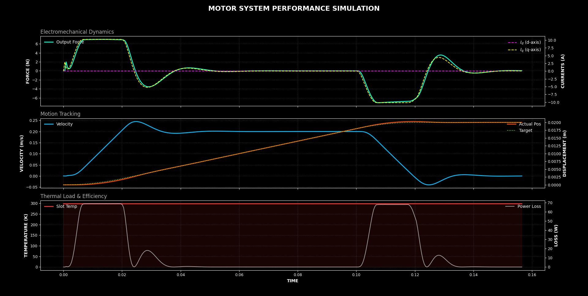

  
   
  <em>A Solver-Adaptor Engine for Multi-Physics Simulation & Optimization
   – Built with headaches by <a href="https://github.com/wgbowley">William Bowley</a></em>

## Overview
Sick of glue code and brittle pipelines? Annoyed by having to learn 10 different APIs? What if we could have a single high-level API handle all translation, leaving us to focus on what we're good at? PyFea is a solver-adaptor engine that functions as a single high-level API for finite element and lumped parameter multi-physics problems. PyFea leverages (unit informed values) DSL and runtime checking for configuration files and material libraries. Currently, PyFea supports these physics domains: thermal, magnetic, electric, and electric circuits.

## Where to go next

**Current status (March 2026)**  
> The active, and installable version of pyfea is on the **`release`** branch.  
> All the code, examples, documentation, packaging files (`setup.py`), and full README are there.

Jump to the **release branch** for everything: <a href="https://github.com/wgbowley/PyFEA/tree/release">pyfea/release</a>

- Full README with usage examples, features, and philosophy  
- Source code in `src/pyfea/`  
- Practical examples in `examples/`  
- Docs in `docs/` 
- Ready-to-install setup files  

> [!NOTE]
> PyPI is currently not the supported install path. Use manual installation via setup.py from the release branch instead. (No official release yet.)

(Once stabilized, this main branch will be updated with the merged/final code.)

## Sneak Peak
This example is of a tubular linear motor using quasi-transient modelling across multiple physics domains and took about 400 time steps.

