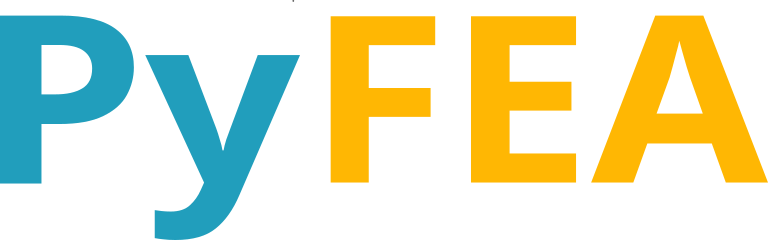

<!--
Color palette:
#219EBC -> cool, mid-tone cerulean blue 
#ffb703 -> warm, golden-amber yellow 

Pretty Standard Stuff - William Bowley 11th of August, 2026
-->

<p align="center">
   
</p>
<p align="center">An intermediate representation system for multi-physics problems.</p>
<p align="center">
  Define Topology, Attach Metadata, Solve.
  <br>
  Keep consistent representation across physics.
</p>

--- 


> [!IMPORTANT]
> This README contains the architectural and conceptual vision of `PyFEA`. Version `0.1` is intended to be released on `December 11, 2026`.

## Overview

PyFEA is a solver-adaptor engine that functions as an intermediate representation system for computational engineering. 
It creates a consistent representation across domains because continuous problems should use continuous tooling. 

> [!IMPORTANT]
> Objectives:
> - Allow for the same methodology across domains: define, attach, and solve. 
> - Allow for solver-adaptors across `planar`, `axisymmetric`, and `full 3D` solutions using `CSG`.
> - Support integration with solvers across finite element, lumped parameters, and SPICE models.
> - Restrict all inputs and outputs to dimensionally consistent units.

## What is a Solver Adaptor?

An abstract boundary between a solver and `PyFEA`, it allows `PyFEA` to orchestrate the problem while the solver computes the solution.

For example, if you wanted to simulate an axial flux motor, it would require a 3D magnetostatic solver and perhaps a 
circuit solver for the `triple half-bridge` driver.

```
SPICE Circuit Solver
        ↓
3D Magnetostatic Solver
        ↓
Mechanical Integrator
         ↺
```

This is much easier than writing one large solver for `axial flux motors`. However, this isn't the only benefit. 
The main benefit is that a new arbitrary problem becomes a single custom adaptor away from solving.

For example, if you wanted to simulate an `Astrospheric ion engine`, it would require a 3D electromagnetic solver and a 3D fluid dynamics solver. 
But what about ionization? This is where a custom solver-adaptor comes in — you can write your own ionization solver and the pipeline is complete.

```
3D Electromagnetic Solver
          ↓
3D Fluid Dynamics Solver
          ↓
Custom Ionization Solver
          ↺
```

## High-Level Architecture

PyFEA has a series of foundational dependencies that allow the engine itself to stay streamlined.

```
UIV (DSL) → PicoUnits (Runtime Analysis) → PicoMaterials (Material Library) → PyFEA (Solver-Adaptors)
```


Unit-Informed Values (`.uiv`) is the custom domain-specific language for parameter and material files. PicoUnits interprets the `.uiv` 
file format and performs runtime dimensional analysis. Using `.uiv` and PicoUnits, PicoMaterials stores material data and passes material 
assumptions to PyFEA, which orchestrates the solver adaptors to solve the problem and returns the assumption tree.

## Installation

Until release, this only installs the overview page and related files:

```bash
pip install pyfea
```

## Documentation

> [!important]
> `Internal Documentation` refers to engineering logs, problem-solving notes, and unpolished application notes. For polished documentation, refer to `External Documentation`.

All internal documentation can be found within this repo's [issues](https://github.com/Bowley-Systems/PyFEA/issues).