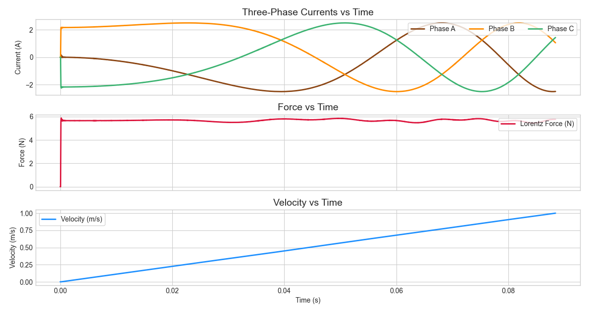

<p align="center">
  
  <br>
  <em>Fast Electromechanical Design Explorer for Linear Motors – built with love by <a href="https://github.com/wgbowley">William Bowley</a> & friends</em>
</p>

---


Part of the `blue` series projects, with the goal of making linear motors viable for 3D printing and other applications at the hobbyist level.

## Overview
**BlueShark** is a idealized exploration tool for linear motor designs. It is designed for integration with optimizers and its targeted applications include:
- 3D printers
- Pick-and-place machines
- Laser cutters
- Other electromechanical systems

Currently, FEMM (Finite Element Method Magnetics) is the primary solver and renderer. Future releases will support additional solvers.


## Example Simulation
This example demonstrates a quasi-transient simulation of a **Tubular Linear Synchronous Motor (TLSM)**.  
The figure below shows **Current, Force, and Velocity vs. Time**:

<div align="center">
  
</div>

*Full configuration and simulation code for this analysis is available here:*  [`examples/tubular_motor`](./examples/tubular_motor/)


## Installation

### 1. Install FEMM (Windows Only)
FEMM is a free, open-source tool for low-frequency electromagnetic simulations, ideal for motor design.  

- Download and install FEMM from the official website:  
  [https://www.femm.info/wiki/HomePage](https://www.femm.info/wiki/HomePage)  
- Ensure FEMM is added to your system PATH or installed in the default location (usually `C:\femm42`) so BlueShark can call it automatically.

### 2. Install BlueShark
Clone the repository and install the package locally in editable mode:

```bash
git clone https://github.com/wgbowley/BlueShark-FEA.git
cd BlueShark-FEA
pip install -e .
```

## Usage
This section is under development. A detailed usage example will be provided here soon.
- *Example of what the universal 2D ```PyFEA``` framework may look like: [`electromagnet`](./examples/electromagnet/electromagnet.py)*

